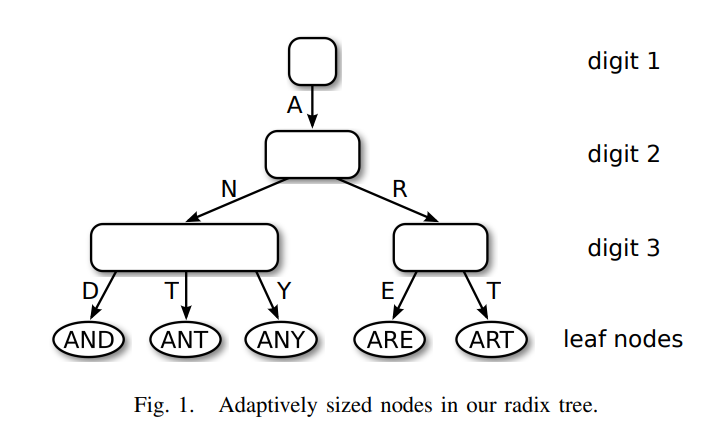

## ART

这个库提供了Adaptive Radix Tree(ART)的c++实现。

相较于传统的基数树，ART通过前缀压缩减少竖向的节点数量，通过各种容量的节点(4, 16, 48, 256)减少节点空间占用大小，在空间上更优。

我们的ART实现提供:

- O(len(key))时间复杂度的get/set/del操作
- 相较于[libart](https://github.com/armon/libart/tree/master), 本库ART的操作都用**迭代而非递归**实现
- get/set/del操作**都是线程安全**的，并且通过乐观加锁，线程间充分地并发。 -- Todo: 添加测试
- 充足的测试，**行覆盖率达到90%以上**

### 使用例子

运行以下代码，将得到一个论文中描述的art树。



```c++
  art::ArtTree<int64_t> artTree;

  artTree.set("ant", 1);
  artTree.set("and", 2);
  artTree.set("any", 3);
  artTree.set("are", 4);
  artTree.set("art", 5);

  std::cout << artTree << std::endl;
```
Output:
```text
type:Node4, prefix:a, ccnt:2
-key char:n, type:Node4, prefix:, ccnt:3
--key char:d, type:Leaf, key:and
--key char:t, type:Leaf, key:ant
--key char:y, type:Leaf, key:any
-key char:r, type:Node4, prefix:, ccnt:2
--key char:e, type:Leaf, key:are
--key char:t, type:Leaf, key:art
```


### 性能测试

todo():


### 引用

[The Adaptive Radix Tree:ARTful Indexing for Main-Memory Databases](https://db.in.tum.de/~leis/papers/ART.pdf)

[The ART of Practical Synchronization](https://db.in.tum.de/~leis/papers/artsync.pdf)
